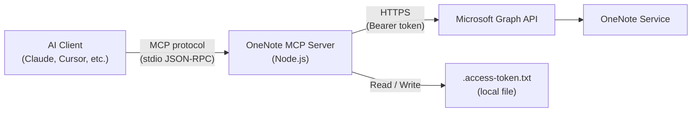
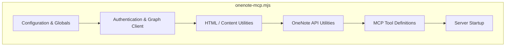
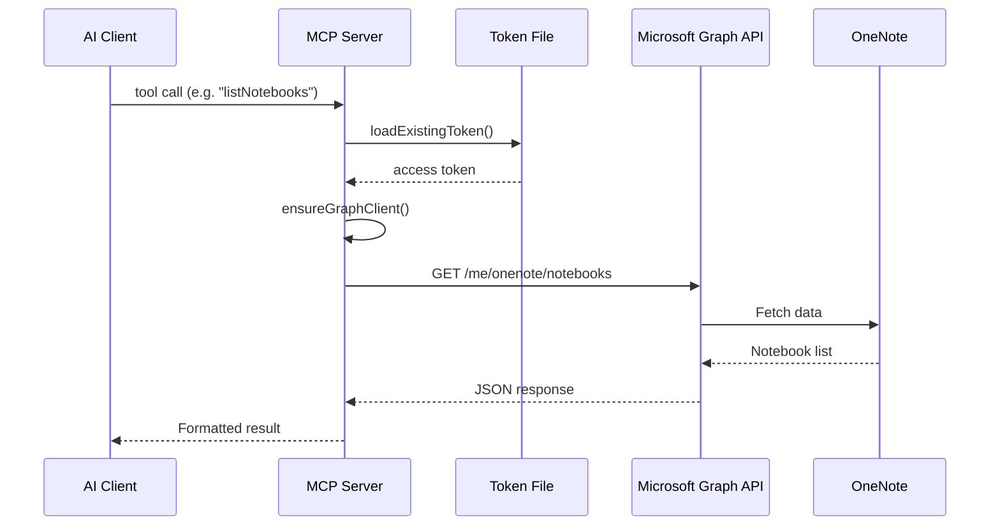
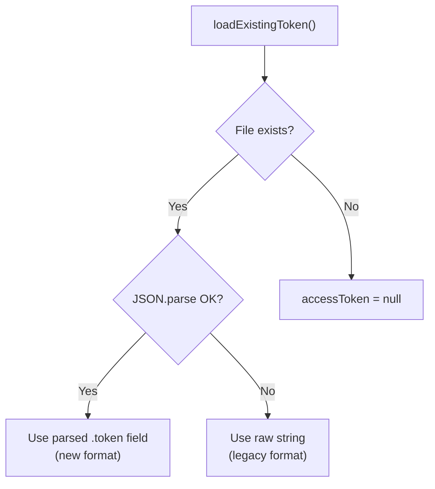
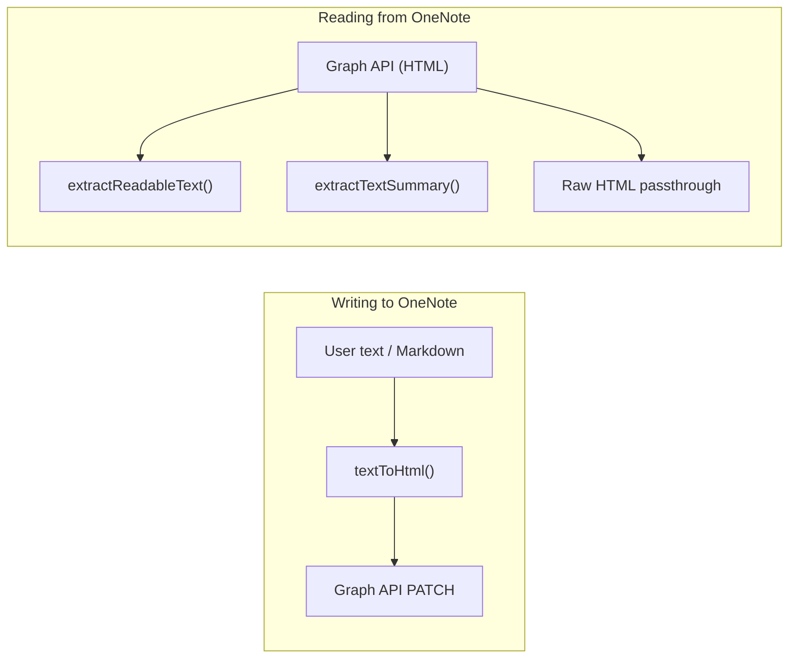
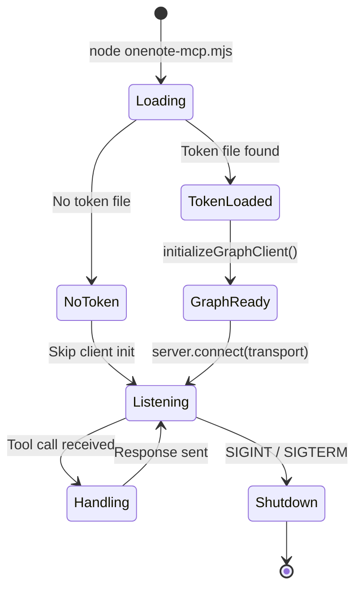

# Architecture Overview

This document describes the high-level architecture of the OneNote MCP Server, its components, and how data flows between an AI client and Microsoft OneNote.

## System Context

The server sits between an MCP-compatible AI client and the Microsoft Graph API. It translates natural-language–driven tool calls into authenticated Graph API requests and returns structured results.

## Single-File Design

The entire server lives in **`onenote-mcp.mjs`** (~780 lines). This deliberate choice keeps deployment trivial — a single `node` command starts the server. The file is organized into clearly separated sections:

### Section Breakdown

| Section | Lines (approx.) | Responsibility |
|---------|-----------------|----------------|
| Configuration & Globals | 1–25 | Imports, file paths, client ID, scopes, global state |
| Authentication & Graph Client | 26–90 | Token loading, Graph client initialization, `ensureGraphClient()` |
| HTML / Content Utilities | 91–205 | `extractReadableText()`, `extractTextSummary()`, `textToHtml()` |
| OneNote API Utilities | 206–245 | `fetchPageContentAdvanced()`, `formatPageInfo()` |
| MCP Tool Definitions | 246–760 | All 13 tool registrations |
| Server Startup | 761–end | `main()` bootstrap, signal handlers |

## Component Interaction

## Key Design Decisions

### 1. Stdio Transport

The server uses `StdioServerTransport` from the MCP SDK. Communication happens over **stdin/stdout** using JSON-RPC, which is the standard MCP transport for local processes. Diagnostic messages go to **stderr** so they don't interfere with the protocol.

### 2. Dual HTTP Strategy for Page Content

`fetchPageContentAdvanced()` supports two methods:

| Method | Mechanism | When Used |
|--------|-----------|-----------|
| `httpDirect` (default) | Raw `fetch()` to Graph REST endpoint | All page content reads – more reliable for binary/HTML content |
| `direct` | Graph SDK `.api().get()` | Available as fallback |

### 3. Token Persistence

Tokens are stored locally in `.access-token.txt` as JSON (with metadata) or as a plain string (legacy format). The loader handles both formats transparently.

### 4. Input Validation with Zod

Every tool defines its parameters using **Zod schemas** inline within the `server.tool()` registration. The MCP SDK uses these schemas to:

- Validate inputs before the handler executes.
- Auto-generate JSON Schema for client tool discovery.

### 5. Content Format Pipeline

Content flows through several transformations depending on direction:

## Error Handling Strategy

All tool handlers follow a consistent pattern:

1. **Try/Catch wrapper** — every handler catches exceptions.
2. **`ensureGraphClient()`** — throws early if no token is available, with a user-friendly message directing to the `authenticate` tool.
3. **HTTP status checks** — raw `fetch()` calls check `response.ok` and throw with status details.
4. **`isError` flag** — failed tool responses set `isError: true` so the MCP client can distinguish success from failure.

## Process Lifecycle

