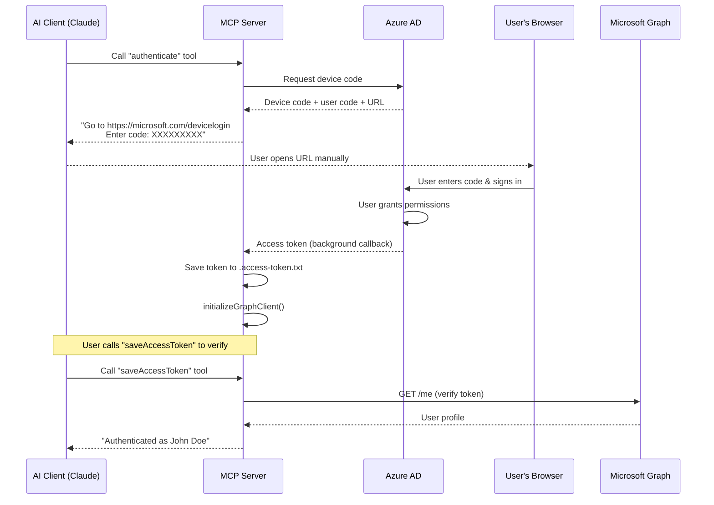
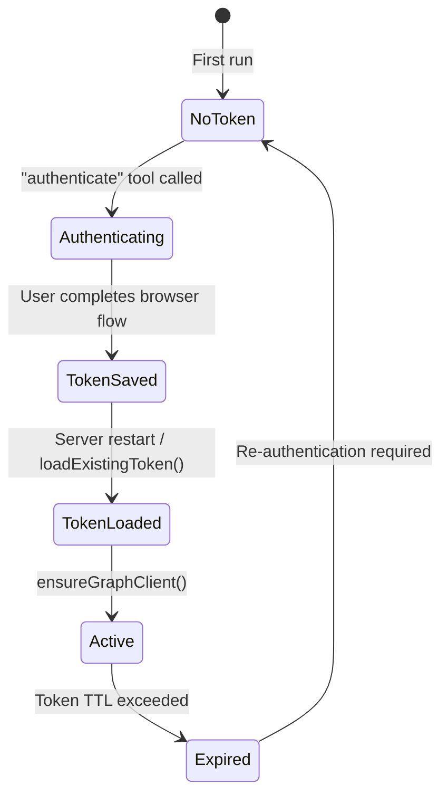
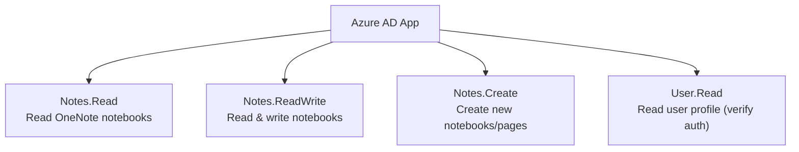

# Authentication Guide

This document explains how the OneNote MCP Server authenticates with Microsoft Graph, how tokens are managed, and how to troubleshoot common authentication issues.

## Overview

The server uses the **OAuth 2.0 Device Code Flow**, which is designed for devices and environments that cannot open a browser inline (exactly the case for an MCP stdio server). No redirect URI or client secret is required.

## Device Code Flow



## Step-by-Step

1. **Invoke `authenticate`** — Your AI assistant calls the tool. The server creates a `DeviceCodeCredential` and requests a device code from Azure AD.

2. **Device code displayed** — The server returns a message containing:
   - A URL: `https://microsoft.com/devicelogin`
   - A one-time user code (e.g., `GRLF8MQ3D`)

3. **Browser sign-in** — Open the URL, enter the code, sign in with your Microsoft account, and grant the requested permissions.

4. **Token saved automatically** — The `DeviceCodeCredential` resolves in the background. The server writes the token (plus metadata) to `.access-token.txt`:
   ```json
   {
     "token": "eyJ0eXAiOiJKV1...",
     "clientId": "14d82eec-...",
     "scopes": ["Notes.Read", "Notes.ReadWrite", "Notes.Create", "User.Read"],
     "createdAt": "2026-04-04T10:00:00.000Z",
     "expiresOn": "2026-04-04T11:00:00.000Z"
   }
   ```

5. **Verify with `saveAccessToken`** — This tool loads the token from disk, initializes the Graph client, and calls `GET /me` to confirm the token works.

## Token Lifecycle



### Token Storage

| Field | Description |
|-------|-------------|
| `token` | The Bearer access token string |
| `clientId` | The Azure App Client ID used |
| `scopes` | Permissions granted |
| `createdAt` | ISO timestamp of token creation |
| `expiresOn` | ISO timestamp of expiry (typically 1 hour) |

The file `.access-token.txt` is stored in the server's root directory. **It must be in `.gitignore`** — it is a credential.

### Backward Compatibility

Older versions stored the token as a plain string (no JSON wrapper). The loader detects this automatically:

```javascript
try {
  const parsed = JSON.parse(tokenData);  // New format
  accessToken = parsed.token;
} catch {
  accessToken = tokenData;               // Legacy plain string
}
```

## Azure App Registration

### Default Client ID

If `AZURE_CLIENT_ID` is not set, the server falls back to Microsoft Graph Explorer's public Client ID:

```
14d82eec-204b-4c2f-b7e8-296a70dab67e
```

This is fine for quick testing but **not recommended for production** — Microsoft may rate-limit or revoke public app access.

### Creating Your Own App Registration

1. Go to [Azure Portal → App Registrations](https://portal.azure.com/#blade/Microsoft_AAD_RegisteredApps/ApplicationsListBlade).
2. Click **New registration**.
3. Set a name (e.g., "OneNote MCP Server").
4. Under **Supported account types**, choose "Accounts in any organizational directory and personal Microsoft accounts".
5. No redirect URI is needed for device code flow.
6. After creation, copy the **Application (client) ID**.
7. Go to **API permissions** → **Add a permission** → **Microsoft Graph** → **Delegated permissions**:
   - `Notes.Read`
   - `Notes.ReadWrite`
   - `Notes.Create`
   - `User.Read`
8. Set the environment variable:
   ```bash
   export AZURE_CLIENT_ID="your-application-client-id"
   ```

### Required Permissions



## Troubleshooting

| Symptom | Cause | Fix |
|---------|-------|-----|
| "No access token available" | Token not yet obtained or file missing | Run the `authenticate` tool |
| Device code expired | Took too long to complete browser flow | Re-run `authenticate` — codes expire in ~15 minutes |
| 401 Unauthorized from Graph API | Token expired | Re-run `authenticate` |
| "AADSTS7000218: request body must contain client_assertion" | Wrong app type in Azure | Ensure public client flows are enabled in the app registration |
| Token file exists but tools fail | Token expired but file persists | Delete `.access-token.txt` and re-authenticate |
| Rate limiting / throttling | Using the default public Client ID | Create your own Azure App Registration |
