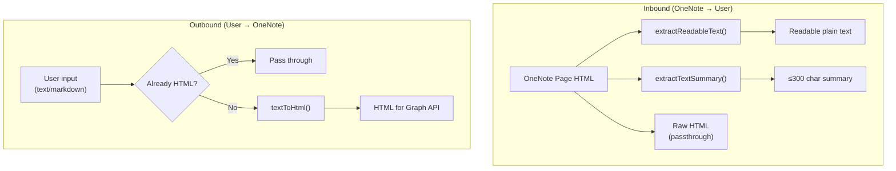
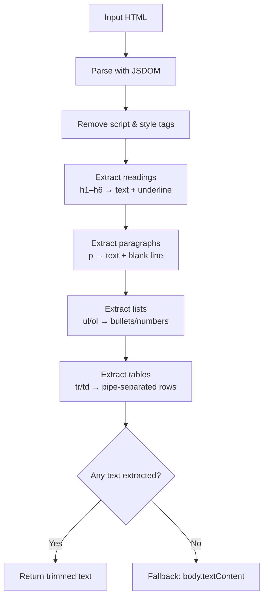
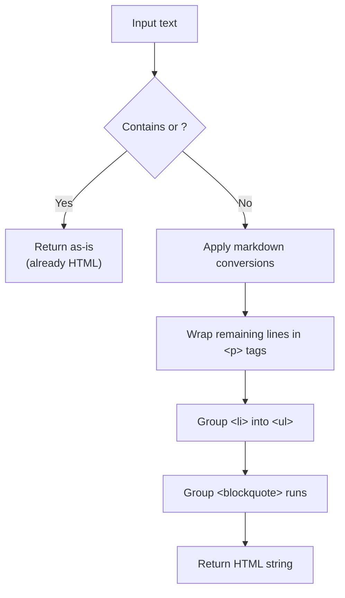
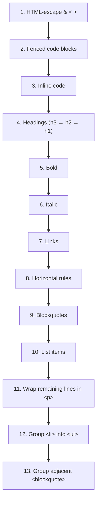
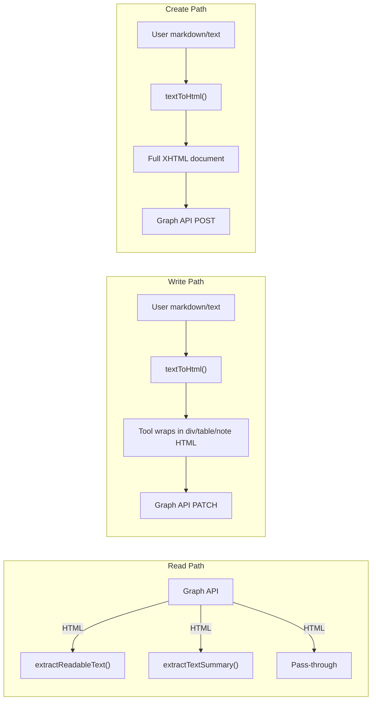

# Content Processing

This document covers the internal utilities that convert content between HTML, plain text, and markdown. These functions are the backbone of every read and write operation.

## Processing Pipeline Overview



---

## `extractReadableText(html)`

Converts raw OneNote HTML into structured, readable plain text. Used when the `format` parameter is `"text"`.

### Algorithm



### Formatting Rules

| HTML Element | Output Format |
|-------------|---------------|
| `<h1>` – `<h6>` | Text followed by a line of dashes (`---`) |
| `<p>` | Text followed by a blank line |
| Unordered list (`<ul><li>`) | `- item` |
| Ordered list (`<ol><li>`) | `1. item`, `2. item`, ... |
| Table (`<table>`) | `📊 Table content:` header, then pipe-separated rows |
| Everything else | Falls back to `body.textContent` with whitespace collapsed |

### Example

**Input HTML:**
```html
<h1>Meeting Notes</h1>
<p>Discussed Q2 goals with the team.</p>
<ul>
  <li>Launch feature X</li>
  <li>Hire two engineers</li>
</ul>
```

**Output text:**
```
Meeting Notes
-------------

Discussed Q2 goals with the team.

- Launch feature X
- Hire two engineers
```

---

## `extractTextSummary(html, maxLength = 300)`

Returns a truncated plain-text summary of the HTML body. Used when the `format` parameter is `"summary"`.

### Algorithm

1. Parse HTML with JSDOM.
2. Get `body.textContent`, trim, and collapse whitespace.
3. Truncate to `maxLength` characters.
4. Append `...` if truncated.

### Example

A 500-character body text becomes:

```
First 300 characters of the page content here...
```

---

## `textToHtml(text)`

Converts plain text (with optional markdown syntax) into HTML suitable for the OneNote PATCH API. Used by all write/edit tools.

### Detection Logic



### Supported Markdown Conversions

| Markdown Syntax | HTML Output |
|----------------|-------------|
| `` ```code``` `` | `<pre><code>code</code></pre>` |
| `` `inline` `` | `<code>inline</code>` |
| `### Heading` | `<h3>Heading</h3>` |
| `## Heading` | `<h2>Heading</h2>` |
| `# Heading` | `<h1>Heading</h1>` |
| `**bold**` or `__bold__` | `<strong>bold</strong>` |
| `*italic*` or `_italic_` | `<em>italic</em>` |
| `[text](url)` | `<a href="url">text</a>` |
| `---` | `<hr>` |
| `> quote` | `<blockquote>quote</blockquote>` |
| `- item` / `* item` / `+ item` | `<li>item</li>` (grouped into `<ul>`) |
| `1. item` | `<li>item</li>` (grouped into `<ul>`) |
| Plain line | `<p>line</p>` |

### Processing Order

The conversion is applied in a specific order to avoid conflicts:



### Important: HTML Passthrough

If the input already looks like a full HTML document (contains `<html>` or `<!DOCTYPE html>`), the function returns it unchanged. This allows tools like `createPage` to accept raw HTML content directly.

---

## `fetchPageContentAdvanced(pageId, method)`

A utility that fetches the raw HTML content of a OneNote page.

| Method | Implementation | Notes |
|--------|---------------|-------|
| `httpDirect` (default) | `fetch()` with Bearer token to `https://graph.microsoft.com/v1.0/me/onenote/pages/{id}/content` | Preferred — handles binary/HTML reliably |
| `direct` | `graphClient.api(...).get()` | Fallback using the Graph SDK |

---

## `formatPageInfo(page, index)`

Formats a OneNote page object into a display string.

**Output format:**
```
1. **Page Title**
   ID: 0-abc123...
   Created: 4/4/2026
   Modified: 4/4/2026
```

Used by `listNotebooks`, `searchPages`, and other listing tools to present results consistently.

---

## Data Flow Summary


