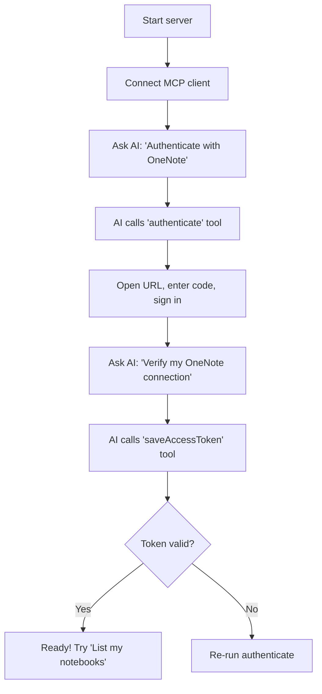

# Setup Guide

Step-by-step instructions to install, configure, and connect the OneNote MCP Server.

## Prerequisites

| Requirement | Minimum Version | Notes |
|-------------|----------------|-------|
| **Node.js** | 18.x | [nodejs.org](https://nodejs.org/) |
| **npm** | Bundled with Node.js | Used for dependency installation |
| **Git** | Any recent version | For cloning the repository |
| **Microsoft Account** | — | Must have OneNote access |

## Installation

```bash
# Clone the repository
git clone https://github.com/eshlon/onenotemcp.git
cd onenotemcp

# Install dependencies
npm install
```

This installs the following packages:

| Package | Purpose |
|---------|---------|
| `@modelcontextprotocol/sdk` | MCP server framework (stdio transport, tool registration) |
| `@azure/identity` | Azure AD device code authentication |
| `@microsoft/microsoft-graph-client` | Microsoft Graph API client |
| `jsdom` | HTML parsing for text extraction |
| `node-fetch` | HTTP client for direct Graph API calls |
| `zod` | Runtime input validation |

## Configuration

### Azure Client ID

The server needs an Azure Application Client ID. You have two options:

#### Option A: Use the Default (Quick Testing)

No configuration needed. The server ships with the Microsoft Graph Explorer public Client ID (`14d82eec-204b-4c2f-b7e8-296a70dab67e`). This works out of the box but may be rate-limited.

#### Option B: Use Your Own App Registration (Recommended)

```bash
export AZURE_CLIENT_ID="your-azure-app-client-id"
```

See the [Authentication Guide](authentication.md#creating-your-own-app-registration) for how to create an App Registration in Azure Portal.

### File Security

Ensure your `.gitignore` includes:

```
node_modules/
.access-token.txt
.env
*.log
```

The `.access-token.txt` file is created at runtime and contains a sensitive Bearer token.

## Running the Server

```bash
node onenote-mcp.mjs
```

On startup, you'll see on stderr:

```
🚀✨ OneNote Ultimate MCP Server is now LIVE! ✨🚀
   Client ID: 14d82eec... (Using default)
   Ready to manage your OneNote like never before!
--- Available Tool Categories ---
   🔐 Auth: authenticate, saveAccessToken
   📚 Read: listNotebooks, searchPages, getPageContent, getPageByTitle
   ✏️ Edit: updatePageContent, appendToPage, updatePageTitle, replaceTextInPage, addNoteToPage, addTableToPage
   ➕ Create: createPage
---------------------------------
```

## Connecting to an MCP Client

### Claude Desktop

Edit the config file:

- **macOS:** `~/Library/Application Support/Claude/claude_desktop_config.json`
- **Windows:** `%APPDATA%\Claude\claude_desktop_config.json`

```json
{
  "mcpServers": {
    "onenote": {
      "command": "node",
      "args": ["/absolute/path/to/onenotemcp/onenote-mcp.mjs"],
      "env": {
        "AZURE_CLIENT_ID": "your-client-id-here"
      }
    }
  }
}
```

### Cursor

1. Open **Preferences → MCP**.
2. Add a new server with the same `command`, `args`, and `env` as above.

### VS Code (Copilot Chat)

Add to your VS Code `settings.json` or `.vscode/mcp.json`:

```json
{
  "mcpServers": {
    "onenote": {
      "command": "node",
      "args": ["/absolute/path/to/onenotemcp/onenote-mcp.mjs"],
      "env": {
        "AZURE_CLIENT_ID": "your-client-id-here"
      }
    }
  }
}
```

## First-Run Workflow



## Troubleshooting

| Problem | Solution |
|---------|----------|
| `Error: Cannot find module` | Run `npm install` in the project directory |
| Server starts but client can't connect | Verify the absolute path in your MCP client config |
| `ENOENT` on startup | Make sure you're running from the correct directory |
| Node version error | Upgrade to Node.js ≥ 18 (`node -v` to check) |
| Tools not appearing in client | Restart the MCP client after config changes |
| Authentication fails silently | Check stderr output — diagnostic messages go there, not stdout |
