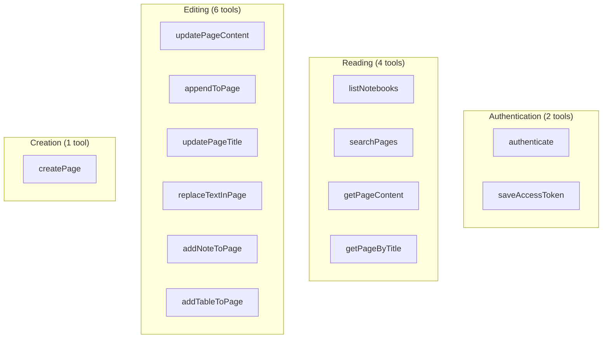
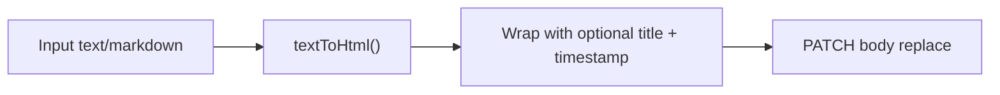

# Tools API Reference

Complete reference for every MCP tool exposed by the OneNote MCP Server. Tools are grouped by category.

## Tool Map



---

## Authentication Tools

### `authenticate`

Initiates the OAuth 2.0 Device Code Flow with Azure AD. Returns a URL and a one-time code the user must enter in a browser.

| Parameter | Type | Required | Description |
|-----------|------|----------|-------------|
| *(none)* | — | — | This tool takes no parameters |

**Returns:** A message with the device login URL and user code.

**Side effects:** Starts a background process that writes the token to `.access-token.txt` upon successful browser authentication.

---

### `saveAccessToken`

Loads the locally saved token from `.access-token.txt`, initializes the Graph client, and verifies the token by calling `GET /me`.

| Parameter | Type | Required | Description |
|-----------|------|----------|-------------|
| *(none)* | — | — | This tool takes no parameters |

**Returns:** Account name and email on success; error if no token file exists or the token is invalid.

---

## Reading Tools

### `listNotebooks`

Lists all OneNote notebooks for the authenticated user.

| Parameter | Type | Required | Description |
|-----------|------|----------|-------------|
| *(none)* | — | — | This tool takes no parameters |

**Returns:** A numbered list of notebooks with name, ID, creation date, and last modified date.

**Graph API:** `GET /me/onenote/notebooks`

---

### `searchPages`

Searches for pages by title across all notebooks.

| Parameter | Type | Required | Default | Description |
|-----------|------|----------|---------|-------------|
| `query` | `string` | No | *(all pages)* | Search term to match against page titles (case-insensitive substring match) |

**Returns:** Up to 10 matching pages with title, ID, and dates. If more than 10 match, a count of remaining pages is shown.

**Graph API:** `GET /me/onenote/pages` (client-side filtering)

> **Note:** Filtering is done client-side after fetching all pages. For large OneNote accounts, this fetches the full page list on each call.

---

### `getPageContent`

Retrieves the content of a specific page by its ID.

| Parameter | Type | Required | Default | Description |
|-----------|------|----------|---------|-------------|
| `pageId` | `string` | **Yes** | — | The OneNote page ID |
| `format` | `"text"` \| `"html"` \| `"summary"` | No | `"text"` | Output format |

**Format options:**

| Format | Description |
|--------|-------------|
| `text` | Readable plain text extracted from HTML (headings, paragraphs, lists, tables) |
| `html` | Raw HTML as returned by the Graph API |
| `summary` | First 300 characters of extracted body text |

**Graph API:** `GET /me/onenote/pages/{pageId}` (metadata) + `GET /me/onenote/pages/{pageId}/content` (HTML body)

---

### `getPageByTitle`

Finds a page by title (partial match) and retrieves its content.

| Parameter | Type | Required | Default | Description |
|-----------|------|----------|---------|-------------|
| `title` | `string` | **Yes** | — | Title or partial title to search for |
| `format` | `"text"` \| `"html"` \| `"summary"` | No | `"text"` | Output format (same as `getPageContent`) |

**Behavior:** Returns the **first** page whose title contains the search string (case-insensitive). If no match is found, lists up to 10 available pages.

**Graph API:** `GET /me/onenote/pages` (then client-side filtering) + content fetch for the matched page.

---

## Editing Tools

### `updatePageContent`

Replaces the entire body content of an existing page.

| Parameter | Type | Required | Default | Description |
|-----------|------|----------|---------|-------------|
| `pageId` | `string` | **Yes** | — | The page ID to update |
| `content` | `string` | **Yes** | — | New content (HTML or markdown) |
| `preserveTitle` | `boolean` | No | `true` | Keep the original page title as an `<h1>` at the top |

**Graph API:** `PATCH /me/onenote/pages/{pageId}/content`  
**Action:** `replace` on `body` target

**Content pipeline:**


---

### `appendToPage`

Appends new content to the end of an existing page.

| Parameter | Type | Required | Default | Description |
|-----------|------|----------|---------|-------------|
| `pageId` | `string` | **Yes** | — | The page ID |
| `content` | `string` | **Yes** | — | Content to append (HTML or markdown) |
| `addTimestamp` | `boolean` | No | `true` | Prepend a timestamp to the appended block |
| `addSeparator` | `boolean` | No | `true` | Add an `<hr>` before the appended content |

**Graph API:** `PATCH /me/onenote/pages/{pageId}/content`  
**Action:** `append` on `body` target

---

### `updatePageTitle`

Changes the title of an existing page.

| Parameter | Type | Required | Description |
|-----------|------|----------|-------------|
| `pageId` | `string` | **Yes** | The page ID |
| `newTitle` | `string` | **Yes** | The new title |

**Graph API:** `PATCH /me/onenote/pages/{pageId}/content`  
**Action:** `replace` on `title` target

---

### `replaceTextInPage`

Finds and replaces text within a page's HTML content.

| Parameter | Type | Required | Default | Description |
|-----------|------|----------|---------|-------------|
| `pageId` | `string` | **Yes** | — | The page ID |
| `findText` | `string` | **Yes** | — | Text to search for |
| `replaceText` | `string` | **Yes** | — | Replacement text |
| `caseSensitive` | `boolean` | No | `false` | Enable case-sensitive matching |

**Behavior:**
1. Fetches the full HTML content of the page.
2. Escapes `findText` for safe use in a regex.
3. Applies a global replace (`g` or `gi` flag).
4. PATCHes the modified HTML back to the body.

**Returns:** Number of replacements made, or a message if no matches were found.

---

### `addNoteToPage`

Adds a formatted, styled note block to a page.

| Parameter | Type | Required | Default | Description |
|-----------|------|----------|---------|-------------|
| `pageId` | `string` | **Yes** | — | The page ID |
| `note` | `string` | **Yes** | — | Note content |
| `noteType` | `"note"` \| `"todo"` \| `"important"` \| `"question"` | No | `"note"` | Visual style |
| `position` | `"top"` \| `"bottom"` | No | `"bottom"` | Where to insert |

**Note styles:**

| Type | Icon | Background Color |
|------|------|-----------------|
| `note` | 📝 | `#e3f2fd` (light blue) |
| `todo` | ✅ | `#e8f5e8` (light green) |
| `important` | 🚨 | `#ffebee` (light red) |
| `question` | ❓ | `#fff3e0` (light orange) |

**Graph API:** `PATCH /me/onenote/pages/{pageId}/content`  
**Action:** `prepend` (top) or `append` (bottom) on `body` target

---

### `addTableToPage`

Inserts an HTML table into a page from CSV data.

| Parameter | Type | Required | Default | Description |
|-----------|------|----------|---------|-------------|
| `pageId` | `string` | **Yes** | — | The page ID |
| `tableData` | `string` | **Yes** | — | CSV data (first row = headers) |
| `title` | `string` | No | — | Optional table heading |
| `position` | `"top"` \| `"bottom"` | No | `"bottom"` | Where to insert |

**CSV parsing:** Splits by newline, then by comma. Each cell is trimmed. Requires at least 2 rows (header + 1 data row).

**Example input:**
```
Name, Role, Email
Alice, Engineer, alice@example.com
Bob, Designer, bob@example.com
```

---

## Creation Tools

### `createPage`

Creates a new OneNote page in the **first available section** of the user's notebooks.

| Parameter | Type | Required | Description |
|-----------|------|----------|-------------|
| `title` | `string` | **Yes** | Page title (cannot be empty) |
| `content` | `string` | **Yes** | Page body content — HTML or markdown (cannot be empty) |

**Behavior:**
1. Fetches all sections via `GET /me/onenote/sections`.
2. Selects the first section.
3. Converts content via `textToHtml()`.
4. POSTs a full XHTML document to the section's pages endpoint.

**Graph API:** `POST /me/onenote/sections/{sectionId}/pages`  
**Content-Type:** `application/xhtml+xml`

**Returns:** Page title, ID, section name, and creation timestamp.

---

## Common Patterns

### Authentication Guard

Every tool that accesses OneNote calls `ensureGraphClient()` at the start. If no token is available, it throws an error directing the user to run `authenticate`.

### Error Response Shape

All error responses follow the same structure:

```json
{
  "isError": true,
  "content": [{ "type": "text", "text": "❌ Error message..." }]
}
```

### Graph API PATCH Format

All editing tools use the OneNote PATCH API with an array of operations:

```json
[
  {
    "target": "body",
    "action": "append",
    "content": "<p>New content</p>"
  }
]
```

Valid targets: `body`, `title`  
Valid actions: `replace`, `append`, `prepend`
